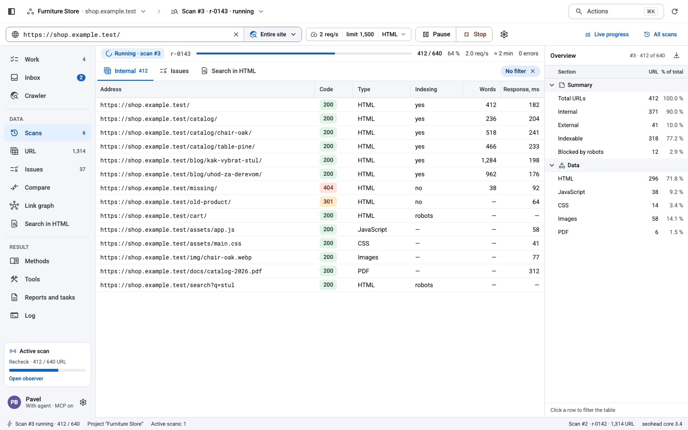
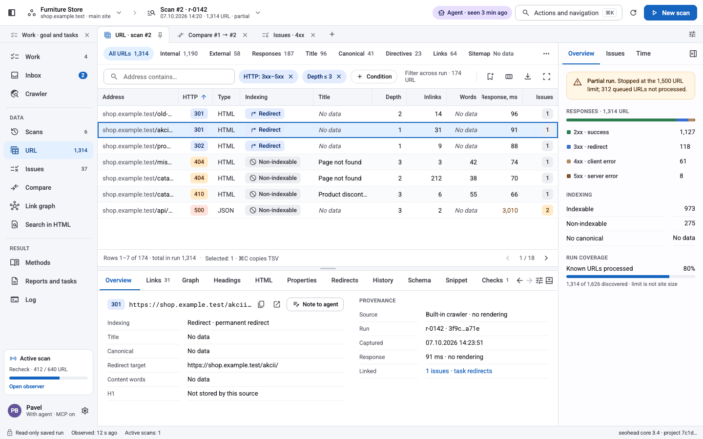
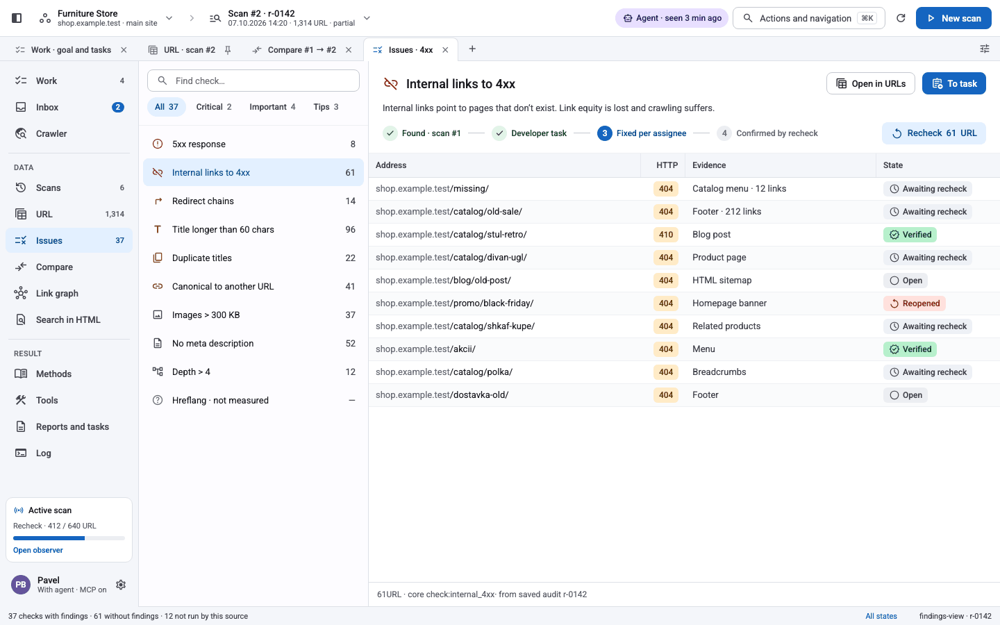
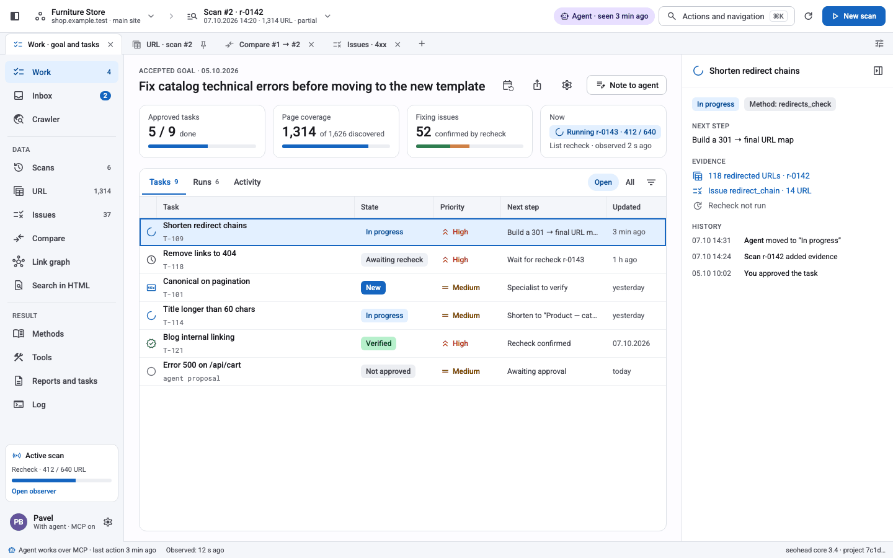
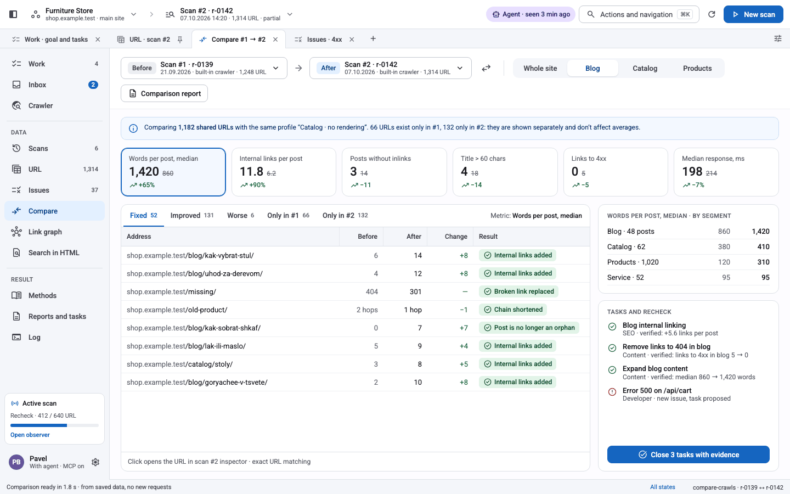
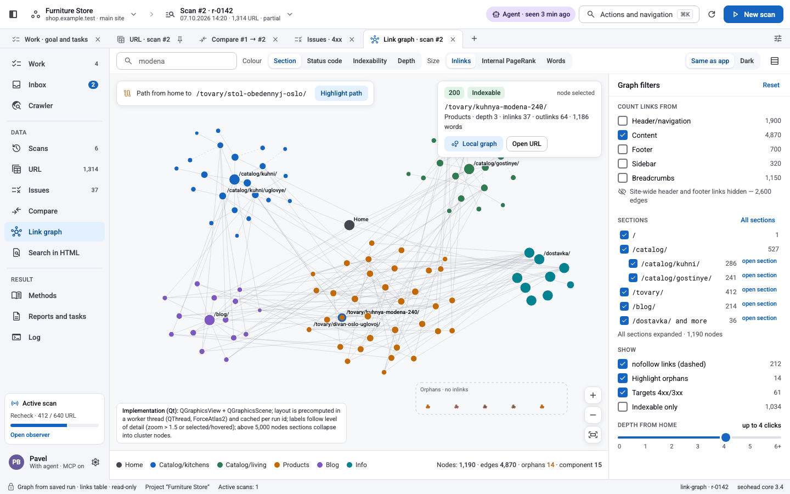
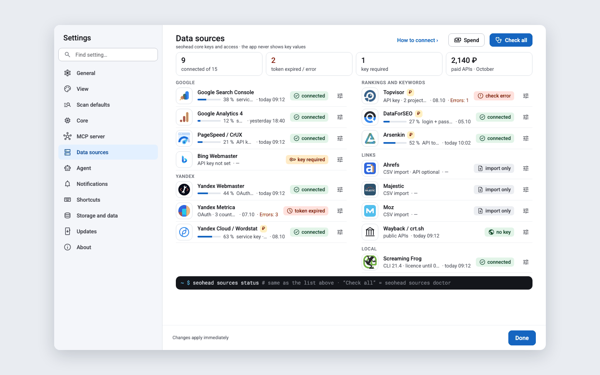
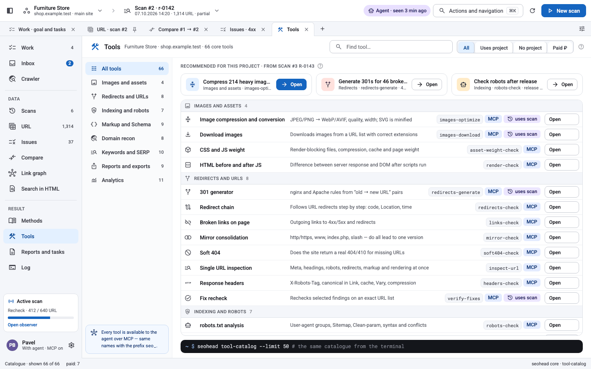
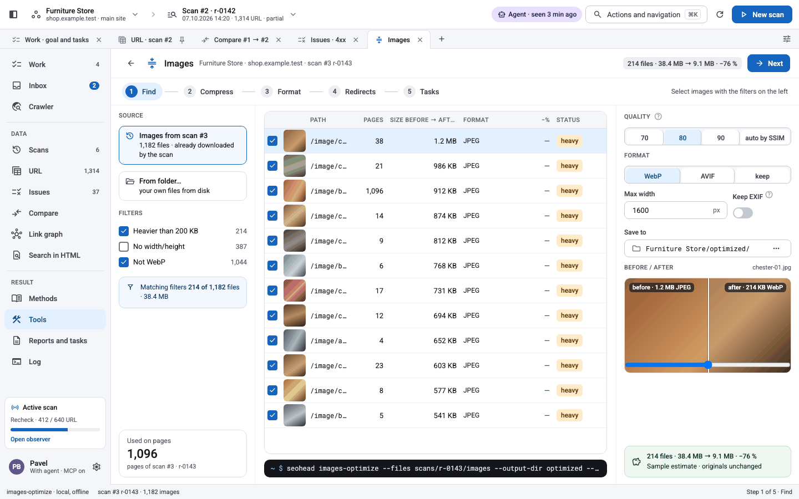
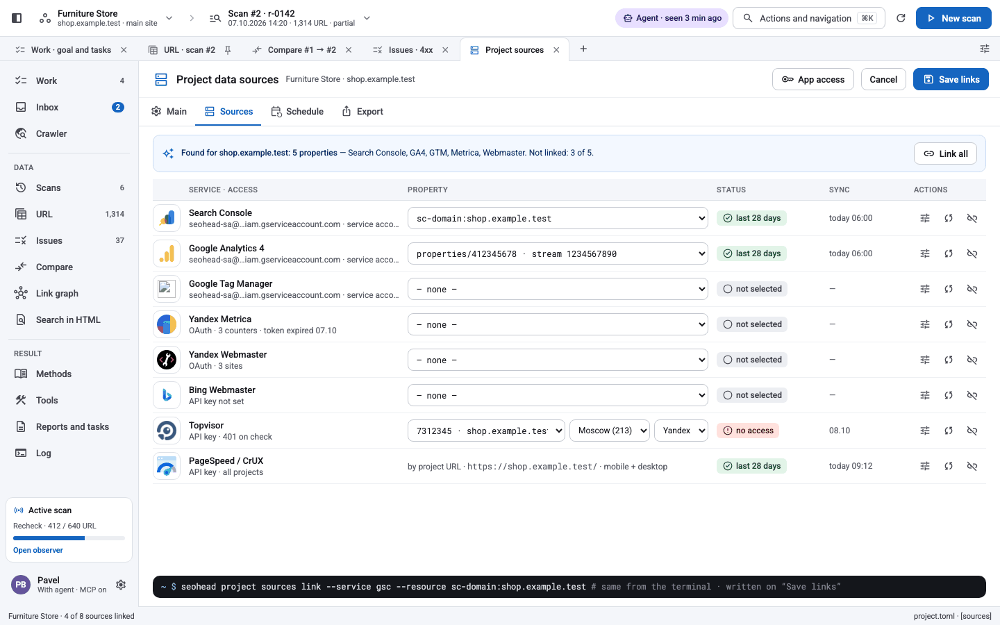

<p align="center"></p>


<p align="center">
<a href="https://seohead.tech/seotools">Website</a> · <a href="docs/README.md">Documentation</a> · <a href="docs/CLI.md">CLI overview</a> · <a href="docs/examples/README.md">Examples</a> · <a href="docs/COMPARISON.md">Scope and trade-offs</a>
</p>

[](https://github.com/PavloSEO/seohead-tools/actions/workflows/ci.yml)


[](LICENSE)

SEOHEAD turns a project goal into repeatable technical-SEO work: crawl or import evidence, keep it
in a retained SQLite scan, analyse it offline, compare releases, hand prioritized tasks to
developers, recheck their fixes and build reports. Everything runs on your machine through one
Python core, with a native desktop app, a CLI and a local MCP server on top. There is no hosted
account and no web dashboard.

**Contents:** [Three ways to use it](#three-ways-to-use-it) · [Install](#install) ·
[Quick start](#quick-start) · [Desktop app](#desktop-app) · [What it can do](#what-it-can-do) ·
[MCP](#mcp-server-for-claude-and-other-agents) · [Projects](#projects-and-agent-handoff) ·
[Honest results](#what-is-measured-and-what-is-not) · [Repository map](#repository-map) ·
[Development](#development)

## Three ways to use it

| Interface | For | Start with |
|---|---|---|
| **Desktop** — SEOHEAD Desktop for macOS, Windows and Linux | Crawling, issues, URL inspector, link graph, toolbox and project work in a native window | `seohead-desktop --project ./shop` |
| **CLI** — `seohead` | Scripts, CI and terminal work | `seohead crawl-site --url https://example.com --max-urls 500 --scan-out ./scans/audit.sqlite` |
| **MCP** — local stdio server | Claude and other agent clients | `claude mcp add seohead -- /absolute/path/to/seohead-tools/.venv/bin/seohead mcp` |

<p align="center"></p>

All three call the same shared handlers (`crawl-site` in the CLI is `seo_crawl_site` over MCP) and
work on the same local projects and retained scans.

## Install

### SEOHEAD Desktop

The app lives in `desktop/` and installs together with the core (Python 3.10 or newer):

```bash
git clone https://github.com/PavloSEO/seohead-tools.git
cd seohead-tools
python -m venv .venv
source .venv/bin/activate
python -m pip install -e ".[all]" -e desktop
seohead-desktop --project /path/to/existing/project
```

Packaging (PyInstaller bundles with the core and the `seohead` CLI) and the source install are
described in `desktop/docs/`.

### Core toolkit (CLI and MCP)

Python 3.10 or newer. Clone the repository and install it into a virtual environment:

```bash
git clone https://github.com/PavloSEO/seohead-tools.git
cd seohead-tools
python -m venv .venv
source .venv/bin/activate
python -m pip install --upgrade pip
python -m pip install -e ".[all]"

# Confirm the installed interface.
seohead --help
```

With [uv](https://docs.astral.sh/uv/), `uv sync --all-extras` creates the same environment from
the committed `uv.lock`, and `uv run seohead --help` runs it. On Windows PowerShell, activate the
virtual environment with `.venv\Scripts\Activate.ps1`.

The repository is named `seohead-tools`; the Python distribution is `seohead-seotools` and the
installed command and import package are `seohead`.

`all` installs every optional dependency; smaller extras (`mcp`, `render`, `reports`, `pdf`, `cluster`,
`gsc`, `sitemap`, `tui`, `remote`) are listed in [SETUP.md](docs/SETUP.md).

Provider credentials and browser binaries are separate and never required for the core crawl.
[Setup from zero](docs/SETUP.md) covers versions, environment variables, Docker
([CONTAINERS.md](docs/CONTAINERS.md)) and Linux servers without a display ([LINUX_VPS.md](docs/LINUX_VPS.md)).

## Quick start

### 1. Crawl a site, audit it, build a report

```bash
# Crawl locally. The URL cap is an explicit budget, not a claim about site size.
seohead crawl-site \
  --url https://example.com \
  --max-urls 500 \
  --scan-out ./scans/audit.sqlite

# Format the retained audit as a working spreadsheet or a client document.
seohead report-build --audit ./scans/audit.sqlite --format xlsx --out audit.xlsx
seohead report-build --audit ./scans/audit.sqlite --format docx --out audit.docx
```

`crawl-site` is the primary collector: free, local, polite by default (about two requests per
second per host), resumable ([RECOVERY.md](docs/RECOVERY.md)) and configurable through
`--config`/`--set` (see `seohead crawl-site --config-help` and
the [configuration inventory](docs/HEADLESS_CAPABILITIES.md)). It sends only bounded, read-only
requests to the site you name. `report-build` formats existing evidence as XLSX, DOCX, CSV,
Markdown, JSON or a bounded PDF overview ([PDF_OVERVIEW.md](docs/PDF_OVERVIEW.md)); it never
invents findings.

### 2. Analyse existing Screaming Frog exports

```bash
# Offline: no SF installation, licence or request to the site is needed.
seohead sf run --exports-dir docs/examples/exports --out ./report --tasks
```

You get `audit.json`, `audit.md` and a prioritized `tasks.md`/`tasks.json` backlog with
reproduction steps, DOM positions and fixes. A separately installed, licensed SF CLI can also be
driven directly with `sf run --crawl`. Other crawlers' CSV exports are not drop-in compatible; they
are read through a versioned manifest ([THIRD_PARTY_CRAWL_IMPORT.md](docs/THIRD_PARTY_CRAWL_IMPORT.md)).

### 3. Run it as a project with an agent

```bash
# These calls only create or inspect local project state; they do not crawl.
seohead project new --directory ./shop --target https://example.com/
seohead project checklist-init --directory ./shop
seohead project progress --directory ./shop
```

Register the MCP server (below), then ask the agent for the outcome you need, for example:

> Audit this site for the agreed scope. Give the developers an Excel workbook of tasks, the
> underlying exports and evidence links, proposed fixes, and acceptance/recheck criteria.

The agent starts from the [control](.claude/skills/control/SKILL.md) skill, records scope and
crawl policy in the project, reuses retained evidence and follows the
[developer handoff](docs/scenarios/deliverable.md) scenario. See
[Projects and agent handoff](#projects-and-agent-handoff).

## Desktop app

SEOHEAD Desktop is a native PyQt5 application for macOS, Windows and Linux. It is a presentation
layer over the same core: it opens the same local projects and retained scans as the CLI and MCP
server, so a crawl started in the terminal or by an agent shows up in the window and the other
way round.

- **Crawler** — enter a URL and press Start, no project needed; save the result as a project later.
- **Project work** — goal, tasks, inbox and run history in a *With agent* display, or the same
  projects, scans and reports without AI features in a *Simple* display.
- **URLs, issues, link graph, compare** — browse retained evidence, rechecks and before/after scans.
- **Tools** — a built-in toolbox: every core tool with a ready-made form, plus a one-click image
  pipeline — compress, convert to WebP/AVIF, generate 301 redirects and hand the task to your
  developer or agent.
- **Methods and reports** — the core's method skills and report builders behind ready-made screens.
- **MCP switch** — one shared state with the CLI (`seohead mcp status`); the app registers the
  server in Claude Code, Claude Desktop, Codex or Cursor only after a permission dialog that lists
  the files and lines it will change, with backups.
- **Installers** — macOS `.pkg`, Windows setup and Linux tarball put the app and the `seohead`
  command on the machine together. Light, dark and high-contrast themes; English and Russian.

<table>
<tr>
<td width="50%"><br><sub><b>URLs</b> — filterable table with per-URL details and provenance</sub></td>
<td width="50%"><br><sub><b>Issues</b> — findings with evidence and recheck status</sub></td>
</tr>
<tr>
<td><br><sub><b>Project work</b> — goal, tasks, next steps and history</sub></td>
<td><br><sub><b>Compare</b> — before/after scans from saved data</sub></td>
</tr>
<tr>
<td><br><sub><b>Link graph</b> — internal links by section, orphans and paths</sub></td>
<td><br><sub><b>Data sources</b> — connected services and their status</sub></td>
</tr>
<tr>
<td><br><sub><b>Tools</b> — every core tool with a ready-made form</sub></td>
<td><br><sub><b>Image pipeline</b> — find, compress, WebP/AVIF, 301s, task</sub></td>
</tr>
<tr>
<td colspan="2"><br><sub><b>Project sources</b> — properties linked to one project, mirrored by <code>seohead</code> CLI commands</sub></td>
</tr>
</table>

## What it can do

Each area links to the page that documents its method, inputs and limits. The
[capability map](docs/README.md#capability-map) answers the same question by engineering task.

| Area | What you get | Read |
|---|---|---|
| **Native desktop app** | macOS, Windows and Linux: scans, issues, URL inspector, link graph, toolbox | [Desktop app](#desktop-app) |
| **Native crawling** | HTTP and optional JavaScript crawling, sitemap/list/URL-file modes, scope and template rules, request/time budgets, robots policy, resume, crawl diagnosis | [USAGE](docs/USAGE.md), [RECOVERY](docs/RECOVERY.md), [URL lists](docs/URL_LIST_SCANS.md), [scale profile](docs/SCAN_CAPACITY_PROFILE.md) |
| **Extraction** | Content selectors, declarative extraction rules over retained bodies, saved-scan source search (for example, which pages carry a GTM marker) | [configuration inventory](docs/HEADLESS_CAPABILITIES.md), [saved evidence](docs/scenarios/saved-evidence.md) |
| **Audit checks** | A generated check registry shared by native crawls and SF exports: status codes, redirects, indexability, canonicals, metadata, headings, hreflang, structured data, images, links, sitemaps, rendering and more | [CHECKS](docs/CHECKS.md), [scenarios](docs/scenarios/README.md), [SF coverage](docs/COVERAGE_SF_ISSUES.md) |
| **Focused URL checks** | `parse`, `robots-check`, `headers-check`, `redirects-check`, `links-check`, `hreflang-check`, `schema-check`/`schema-build`, `render-check`, `soft404-check`, `mirror-check`, `social-meta-check` | [CLI: page checks](docs/CLI.md#page-and-url-checks) |
| **JavaScript and navigation** | Raw versus rendered DOM, rendered routes, observed navigation, lab timings | [browser navigation](docs/BROWSER_NAVIGATION.md), [rendering scenario](docs/scenarios/rendering.md) |
| **Saved scans** | Retained SQLite evidence with provenance: inspect, export, snapshot, pin, prune, requeue, body diff, offline reanalysis | [STORAGE](docs/STORAGE.md), [SQLite acceptance](docs/SQLITE_ACCEPTANCE.md) |
| **Content and semantics** | Near-duplicates, boilerplate, semantic inputs and similarity, meta-description drafts, CTA/form inventory, keyword clustering | [content scenario](docs/scenarios/content.md), [marketing inventory](docs/scenarios/marketing-inventory.md) |
| **AI search (GEO/AEO)** | AI-crawler access in robots.txt, `/llms.txt` scoring, content citability | [AI visibility](docs/scenarios/ai-visibility.md) |
| **Infrastructure and security** | Domain/DNS/hosting profile, CDN and cache behaviour, tech stack, security headers, CT-log subdomains, Wayback history, access-log analysis, regional structure, known-donor backlinks | [infrastructure scenario](docs/scenarios/infrastructure.md), [skills](docs/SKILLS.md#recon-and-technical-hygiene) |
| **Compare and verify** | Before/after crawl diffs, declared URL migrations, segment diffs, bounded fix verification and a remediation ledger with recheck evidence | [COMPARE](docs/COMPARE.md), [LEDGER](docs/LEDGER.md), [comparison scenario](docs/scenarios/comparison.md) |
| **Reports and BI** | XLSX/DOCX/CSV/Markdown/JSON/PDF reports, prioritized task backlog, saved finding views, multi-site facts tables, typed BI packages with Sheets/BigQuery plans | [BI](docs/BI.md), [report fixtures](docs/examples/reports/README.md), [deliverable scenario](docs/scenarios/deliverable.md) |
| **Projects and agents** | Project workspace, checklist coverage, priorities, crawl policy, observer, inbox, checkpointed workflow runs, one-shot monitoring | [PROJECTS](docs/PROJECTS.md), [WORKFLOWS](docs/WORKFLOWS.md), [TERMINAL](docs/TERMINAL.md) |
| **Search and analytics providers** | Search Console, GA4, Yandex Metrika and Webmaster, CrUX, IndexNow, Wordstat/Arsenkin, DataForSEO, Topvisor, Miratext; local history, joins and spend journal | [PROVIDERS](docs/PROVIDERS.md), [provider workflow](docs/scenarios/provider-evidence.md), [GOTCHAS](docs/GOTCHAS.md) |
| **Method skills** | Packaged playbooks and end-to-end scenarios an agent can load (`skill-show`, `scenario-show`) | [SKILLS](docs/SKILLS.md), [scenarios](docs/scenarios/README.md) |
| **Operations** | Optional authenticated remote job API, durable jobs, Docker image, VPS install | [REMOTE_API](docs/REMOTE_API.md), [REMOTE_JOBS](docs/REMOTE_JOBS.md), [CONTAINERS](docs/CONTAINERS.md), [LINUX_VPS](docs/LINUX_VPS.md) |

## MCP server for Claude and other agents

**Claude Code** — register the installed CLI (use the absolute path to your virtual environment):

```bash
claude mcp add seohead -- /absolute/path/to/seohead-tools/.venv/bin/seohead mcp
```

Inside this repository the committed [`.mcp.json`](.mcp.json) already registers `seohead` for
Claude Code when the virtual environment is active.

**Claude Desktop and other stdio clients** — add the server to the client's MCP configuration
(`claude_desktop_config.json` for Claude Desktop):

```json
{
  "mcpServers": {
    "seohead": {
      "command": "/absolute/path/to/seohead-tools/.venv/bin/seohead",
      "args": ["mcp", "--profile", "full"]
    }
  }
}
```

`--profile full` exposes every tool; `audit`, `infra`, `quick-check` and `router` expose smaller
schema sets for focused sessions. `seohead mcp status` shows the shared on/off state that the
desktop app uses too. Progress notifications are sent only when the client supplies
a progress token. See [MCP profiles and progress](docs/MCP_PROFILES.md).

An agent discovers routes with `seo_tool_catalog`, loads a method with `seo_skill_show` and an
end-to-end chain with `seo_scenario_show`. A catalogue entry describes a capability; it does not
execute it. The CLI shows the same catalogue:

```bash
seohead tool-catalog --query redirect --limit 5
```

## Projects and agent handoff

A project directory keeps the site, agreed scope, crawl policy, checklist coverage, retained scans,
saved finding views and run history, so a new agent continues from the saved project instead of
chat history: define the goal and scope, collect once and analyse again, compare, create developer
tasks, track repairs and report.

`seohead watch --project DIRECTORY` opens an optional terminal observer beside the chat
([TERMINAL.md](docs/TERMINAL.md)). The inbox stores the specialist's notes and proposed goals;
workflow runs checkpoint each registered step with hashed evidence so another agent can resume
exactly where the first stopped ([WORKFLOWS.md](docs/WORKFLOWS.md)). Task completion and site
health stay separate: a prepared project or a completed task is not proof that a site error was
fixed. Details: [Projects](docs/PROJECTS.md), [project-control scenario](docs/scenarios/project-control.md),
[remediation ledger](docs/LEDGER.md).

## What is measured and what is not

Every audit separates four outcomes:

- **Finding:** the available evidence supports a specific problem.
- **Ran without findings:** the check was evaluated and found nothing.
- **Skipped:** required evidence was unavailable or incomplete; the report names the check and reason.
- **Failed or unavailable tool:** the boundary failure is recorded instead of being treated as a pass.

Partial crawls withhold conclusions that need complete evidence, such as link-graph claims, and
health scores are withheld or marked not comparable when coverage is low. Native crawls and
Screaming Frog are different collectors and may discover different URL populations; compare them
only with compatible scope, configuration and provenance.

Known limits: native crawl and browser results are lab evidence, not field Core Web Vitals
(`crux-report` is credential-gated); `site-audit` is a bounded sitemap pass, not a link-graph
crawl; `backlinks-check` verifies donor pages you supply rather than a web-scale index; full
parity with commercial crawlers on very large or JavaScript-heavy sites is a direction, not a
verified claim ([COMPARISON.md](docs/COMPARISON.md),
[MILLION_CRAWL_ACCEPTANCE.md](docs/MILLION_CRAWL_ACCEPTANCE.md)).

Safety boundaries: network tools block private targets unless explicitly allowed; file mutation,
service-path probes, bot DNS verification, provider production mode and paid calls require
explicit inputs. DataForSEO defaults to sandbox, and paid calls are journalled for `spend-report`.
Image optimization writes to a separate directory unless in-place mode is requested, which keeps
backups. Secrets and client crawl data never belong in this repository or a client report.
See [the audit guideline](docs/GUIDELINE.md) and [GOTCHAS.md](docs/GOTCHAS.md).

## Repository map

| Path | What it holds |
|---|---|
| `seohead/cli/` | The `seohead` command line over the shared handlers |
| `seohead/mcp/` | Shared handlers and the local stdio MCP server |
| `seohead/crawl/` | Native evidence collection: fetching and parsing, no verdicts |
| `seohead/checks/`, `seohead/audit/` | Audit checks and the audit pipeline over collected evidence |
| `seohead/core/`, `seohead/storage/` | Shared contracts, retained scans and read-only access |
| `seohead/projects/` | Portable local project workspaces |
| `seohead/reports/` | XLSX, DOCX, CSV, Markdown, JSON and PDF output |
| `seohead/recon/`, `seohead/data_sources/` | Domain/infrastructure recon and external providers |
| `seohead/sf/` | Screaming Frog export analysis |
| `seohead/skills/`, `seohead/data/` | Method skills and versioned reference data |
| `seohead/tui/`, `seohead/integrations/` | Optional terminal shell, remote job API and other integrations |
| `desktop/` | SEOHEAD Desktop (PyQt5, GPL-3.0-or-later) with its own toolchain and tests |
| `docs/` | Documentation, scenarios, examples and images |
| `tests/` | Offline test suite for the core |

## Development

```bash
python -m pip install -e ".[dev,mcp,cluster,reports]"
ruff check .
ruff format --check .
pytest -q
seohead sf run --exports-dir docs/examples/exports --out /tmp/seohead-report --tasks
python -m build
```

Public commands, counts and generated references are checked in CI: a command shown in the docs
must still run, and generated pages must match the registries. Keep public prose in English, use
synthetic examples and reserved domains only, and add a focused offline test whenever behaviour
changes. See [CONTRIBUTING.md](CONTRIBUTING.md), [SECURITY.md](SECURITY.md),
[architecture](docs/ARCHITECTURE.md) and [testing](docs/TESTING.md).

## Licence and provenance

The core toolkit and documentation are released under the [MIT License](LICENSE). SEOHEAD Desktop
in `desktop/` is GPL-3.0-or-later, as required by PyQt5 (see `desktop/LICENSE`). The
bundled Schema.org vocabulary keeps its original CC BY-SA terms. See
[THIRD_PARTY_NOTICES.md](THIRD_PARTY_NOTICES.md), [PROVENANCE.md](docs/legal/PROVENANCE.md),
[TRADEMARKS.md](docs/legal/TRADEMARKS.md) and [CITATION.cff](CITATION.cff).

---

<p align="center"><sub> Made with SEOHEAD Tools</sub></p>
