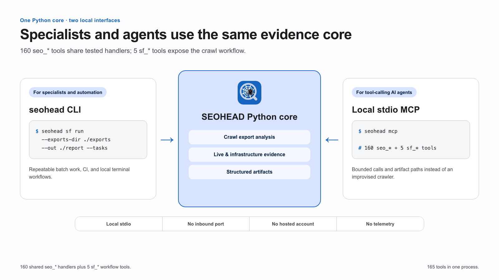

# Architecture

One package `seohead/`, two faces (CLI and MCP), three core layers plus two
service layers. Everything else follows from that.

The optional remote service in epic #754 is a separate delivery adapter.
`recon/remote_policy.py` supplies its project-bound target and egress guard;
`remote_api/backend.py` supplies its durable queue and worker. Neither starts
a listener or alters local CLI/MCP defaults. See [remote target safety](REMOTE_TARGET_SAFETY.md)
and [durable jobs](REMOTE_JOBS.md) for their binding contracts.

## Package layout

```
seohead/
  cli/                the terminal face: `seohead <cmd>` (COMMANDS, main);
                      `seohead sf ...` delegates to seohead/sf/cli.py,
                      `seohead mcp` to seohead/mcp/mcp_server.py
  mcp/                the MCP face: mcp_server.py (build_server), handlers.py
                      (_RAW_HANDLERS, wrapped into HANDLERS) — the shared
                      handlers both faces call; profiles, scan/project/
                      evidence handler modules
  sf/                 CRAWL AUDIT (Screaming Frog analyzer)
    cli.py            own argument parser: run | tasks | doctor | save-config
    config.py         config.json loading (thresholds, severity overrides)
    core/             loader -> context -> rules (registry, 194 checks)
                      -> inlinks -> heuristics -> sitemap_coverage -> aggregate;
                      auth_proxy for protected staging sites,
                      runner for SF CLI mode A
    reporters/        audit.json (against sf/schema/audit.schema.json) + audit.md
    tasks.py          audit.json -> prioritized backlog (tasks.json + tasks.md)
  crawl/              native crawler (collector): spider, SQLite adapters,
                      settings, sitemap capture
  checks/             LIVE URL CHECKS: parser, robots, headers, links,
                      hreflang, redirects, sitemap, downloader, optimizer,
                      clusterer, schema_org + schema_build, page_facts,
                      page_type, duplicate, logs, social_meta, soft404,
                      render, llms_txt, citability, excel, ...
  recon/              DOMAIN & INFRASTRUCTURE RECON: domain, cdn, tech,
                      tech_db, security, backlinks, mirrors, ai_bots,
                      regions, remote_policy — plus net.py, the shared
                      network layer (DoH, RDAP, domain/URL normalization)
  audit/
    site.py           site_audit: bounded sitemap-based pass into one
                      seohead.site-audit/1 document
  reports/            report_build: that document -> xlsx / docx / pdf /
                      csv / md / json (generators compute nothing)
  data_sources/       EXTERNAL DEMAND DATA: credentials, spend journal
                      (JSONL), arsenkin, metrika, gsc, dataforseo (sandbox
                      by default), yandex_cloud, and other provider clients
  integrations/       optional delivery adapters: remote_api/ (authenticated
                      HTTP scan API, extra `remote`); no listener by default
  storage/            SQLite stores and scan/audit ledgers, scan export
  projects/           project workspace, facts, inbox, progress, delivery
  core/               shared contracts (input/job contracts, runlog,
                      verification, provider matrix)
  tui/                `seohead watch` terminal observer
  semantics/          optional semantic-core pipeline (own SQLite DB per
                      project, extra `semantics`); docs/SEMANTICS.md
  skills/             content skills shipped as package-data
  data/               packaged JSON data (e.g. the Schema.org vocabulary)
```

## The main invariant

**The core does not know who called it.** `sf/`, `checks/`, `recon/`,
`data_sources/` and `crawl/` never import `seohead.mcp`, `seohead.cli`,
`seohead.tui` or `seohead.integrations.remote_api`. This is enforced in CI by
`tests/test_interface_binding.py` (the `Enforce core/interface boundary` step
of `.github/workflows/ci.yml`), which discovers the core files from the
filesystem. A separate grep in the `Enforce collector/analyzer boundary` step
keeps `crawl/` and `sf/` from importing each other.

Why: as soon as the core learns about MCP, "if called from MCP, return
something else" code appears, and the two faces drift apart. While the core
returns the same dict to everyone, CLI and MCP cannot diverge in meaning.

Cross-imports **inside** the core are allowed and used: `recon/regions.py`
takes simhash from `checks/duplicate.py`; `checks/schema_org.py` takes the network
client from `recon/net.py`.



## Data flow

```
user -> seohead/cli/__init__.py / seohead/mcp/mcp_server.py
            |  (both call the same thing)
            v
    seohead/mcp/handlers.py        <- the only place where required
            |                        arguments are validated
            v
    checks/ · recon/ · sf/         <- all the logic; the network lives
            |                        only here (and in data_sources/)
            v
    dict with ok/findings          <- one shape for both faces
```

For the crawl audit the flow stays inside the core:

```
SF exports (mode B) or SF CLI crawl (mode A)
    -> loader (pandas, vectorized normalization)
    -> context (per-run state, ctx.skip(id, reason) for missing data)
    -> rules/inlinks/heuristics/sitemap (checks, 187 ids in registry.py)
    -> aggregate (summary, health score, by_check)
    -> reporters (audit.json + audit.md, schema-validated)
    -> tasks.py (prioritized backlog)
```

## Adding a new tool: four places

Miss any one and the tool is not reachable from everywhere — and the logic
tests will not notice, because the function itself works.

1. **Core** — a module in `checks/` or `recon/` with a pure function.
2. **Handler** — a function in `seohead/mcp/handlers.py` plus a row in the
   `_RAW_HANDLERS` dict (`HANDLERS` is derived from it).
3. **CLI** — the name in `COMMANDS` in `seohead/cli/__init__.py`, flags in
   `_add_flags`, argument assembly in `_build_kwargs`.
4. **MCP** — `@mcp.tool()` in `seohead/mcp/mcp_server.py` with a human
   description.

Gate: `tests/test_registration.py` cross-checks `HANDLERS` <-> CLI <-> MCP
and fails if the wiring is incomplete. It exists because of a real case:
`soft-404-check` in the CLI did not match the handler name `soft404_check`,
the tool was dead, and **206 green tests could not see it** — it was found
only by running every command in a row.

## Adding a check to the SF audit

1. A row in `sf/core/registry.py`: `id`, `severity`, `source`, `message`,
   `fix`.
2. A function in `sf/core/rules.py` (or `inlinks.py` / `heuristics.py` /
   `sitemap_coverage.py`).
3. Registration in `ALL_CHECKS`.
4. No data -> `ctx.skip(id, reason)`. **Never a silent zero.**
5. Changed `registry.py` -> run `python scripts/generate_checks_reference.py`
   (writes `docs/CHECKS.md`; `tests/test_docs_drift.py` checks that file).

Thresholds, severity and on/off switches go only through `config.json`. Do
not hardcode numbers: a client must be able to change a threshold without
touching source code.

## Invariants — do not break

**The network never kills a tool.** Everything in `checks/` and `recon/`
returns `{"ok": False, "error": ...}`. No exception escapes to the caller.

**Never lie about what was not measured.** No `h2` package ->
`http_version_measurable: false`, not "the site runs HTTP/1.1". No RDAP and
no `whois` -> `source: none`. Zero regions found -> "nothing to check", not
"no structural errors". Lab metrics are named `metrics_lab` so they cannot
be passed off as field Core Web Vitals.

**Side effects only behind an explicit flag.** `--probe-paths`, the sitemap
live-recheck and `--verify-bots` (DNS queries) are off by default.

**Performance.** Bulk normalization is vectorized (`records_from_df`), never
`df.iterrows()`: on 11k rows that is 1.2 s vs 0.34 s. JSON must contain no
numpy scalars and no `inf`/`NaN`.

**The `audit.json` contract** changes -> update
`sf/schema/audit.schema.json` and the test
`test_reporters.py::test_json_validates_against_schema`.

**CLI and local MCP stay independent of the optional remote contract.** The authenticated HTTP
adapter needs an injected durable backend and egress policy; it starts no service by itself. A
SEOHEAD Desktop (`desktop/`, PyQt5) is a native presentation adapter over the same core. A hosted account,
web dashboard and public MCP endpoint are outside the current boundary.
Report files (xlsx/docx) are output, not an interface.

**MIT project code with compatible dependencies.** Prefer permissive dependencies and review any
weak-copyleft terms before adding a package. That is why `advertools`, not `usp` (GPL). The same
rule keeps the external technology fingerprint database out of the package: the user downloads it
and points to it with an environment variable.

**Money is an invariant.** Every paid call in `data_sources/` writes to the
spend journal (`spend.record()`) *before* parsing the result — a crashed
parser must not turn money into nothing. Yandex SERP is async-only: the synchronous endpoint is
materially more expensive and deliberately absent from the code.

**Secrets only from `~/.config` and the environment** (`credentials.py`).
A missing-secret message carries the path and the variable name, never the
value — logs end up in session transcripts.

## Tests

over 7000 tests, **all offline**; runtime varies by Python version and installed extras. See
[TESTING.md](TESTING.md) for what they cover and what they deliberately do
not.

Verdict logic is factored into pure functions exactly for this reason:
`compare()` in `checks/render.py`, `_findings()` in `recon/regions.py`,
`detect_bot()` in `checks/logs.py`. The browser and the network stay a thin
wrapper the tests do not touch.

**A new recon tool without an offline test is not accepted** — otherwise the
suite only goes green with internet and falls apart on CI.

Fixtures live in `tests/fixtures/`: a synthetic site with deliberate
problems. `test_mcp.py` starts a real stdio server and checks that both the
audit and the live tools work on it (skipped without the `mcp` package).

## Editing workflow

Refactor in small steps; after each step `pytest -q` stays green **and**
`audit.json` on `docs/examples/exports` stays byte-identical (diff by
`summary.by_check`).

Review critical changes adversarially: first "find", then separately
"confirm"; fix only what was confirmed.
